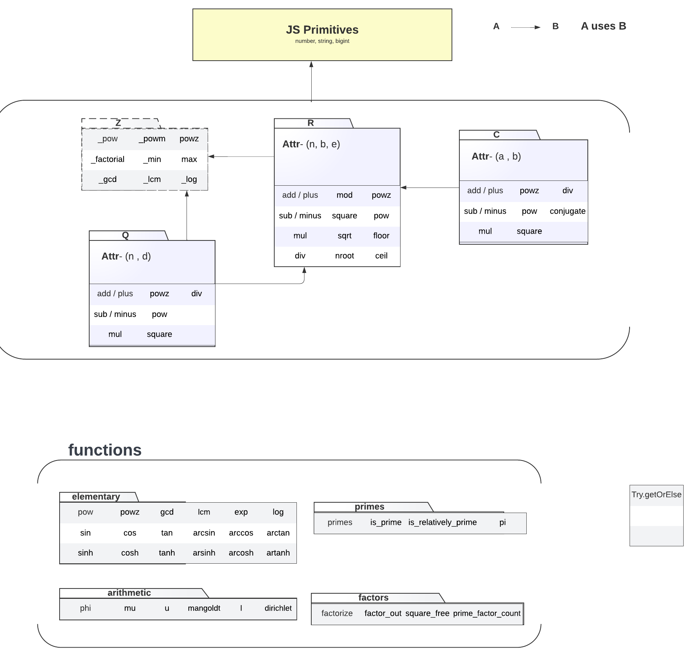

<style>
  .title {
    font-size: 72px;
    font-weight: 900;
  }

  .title-name {
    background: -webkit-linear-gradient(45deg, #00ff36, #003aff);
    -webkit-background-clip: text;
    -webkit-text-fill-color: transparent;
  }

  .title-initial {
    color: #07ba44 !important;
  }

  .title-ext {
    color: #ff5050 !important;
  }
</style>

<h1 class = "title">
  <span class="title-initial">r</span><span class="title-name">math</span><span class="title-ext">js</span>
  v1
</h1>


# Architecture


# Examples
### Init / Basic Ops
```javascript
const rmath = require("@rmath/rmathjs").default
// undefined

// Decimal
> a = rmath.decimal(12.212)
// BigDecimal { n: 12212n, b: 10n, e: 3n }
> a.toString()
// '12.212'

> b = rmath.decimal("12121291029102910291092.90192012909120381121")
> b.toString()
// '12121291029102910291092.90192012909120381121'

// Fraction
> c = rmath.fraction("12/19")
> c.toString()
// 12/19

// Complex 
> d = rmath.complex("1+2i")
> d.toString()
// 1+2i
```
### Basic Operations
``` javascript
const {decimal} = require("@rmath/rmathjs").default

> decimal("121021929102910290194803948309.02910980924808409809380198309810923810928").powz(3).toString()
'1772524366559130330423516606044188242503094282693570981567002894721938643539260475274094.63818437406854206813360000829142'

const {fraction} = require("@rmath/rmathjs").default
// add two fractions
> fraction("12/19").add("1/2").toString()
// '43/38'

// multiply two complex numbers
> complex("1+i").mul("4+12i").toString()
// '-8.0+16.0i'
```
### Arithmetic
This has couple of arithmetic function
```javascript
const {u, I, mu, phi, mangoldt} = require("@rmath/rmathjs/lib/functions").default.arithmetic
> phi(10)
// 4n
> mu(11)
// -1n
```
### Primes
Implemented few operation with primes
```javascript
const {primes, is_prime, pi} = require("@rmath/rmathjs/lib/functions").default.primes
// prime counting function
> pi(10000)
1229
> pi(100)
25
> pi(1000)
168

// primes less than 100
> primes(100)
// [
//    2,  3,  5,  7, 11, 13, 17, 19,
//   23, 29, 31, 37, 41, 43, 47, 53,
//   59, 61, 67, 71, 73, 79, 83, 89,
//   97
// ]

// prime checker, determines probable prime
> is_prime(11111111111111111111777777777n)
// true
> is_prime(111111111111111111117777777777n)
// false
```

### Factors
Factors has functions implementation for factorize the numbers. Currently all implementation uses trial and division. Need to implement for more optimize algos.
```javascript
> const {factorize, factors} = require("@rmath/rmathjs/lib/functions").default.factors
// returns factorization of number using trial and division
> factorize(111111111111111111117777777777n) // 111111111111111111117777777777 = 1 * 3 ^ 2 * 11 * 41 * 43 * 103 * 271 * 463 * 499 * 9091 * 10858510951
// [
//   { k: 1, p: 1 },
//   { p: 3n, k: 2 },
//   { p: 11n, k: 1 },
//   { p: 41n, k: 1 },
//   { p: 43n, k: 1 },
//   { p: 103n, k: 1 },
//   { p: 271n, k: 1 },
//   { p: 463n, k: 1 },
//   { p: 499n, k: 1 },
//   { p: 9091n, k: 1 },
//   { p: 10858510951n, k: 1 }
// ]

// removes specified factor from number. 
> factor_out(1000, 2) // 1000 = 2 ^ 2 * 125
{ f: { p: 2n, k: 3n }, d: 125n }
```


# Convections
## Naming Convections
1. Class / Interface / types should be in CapitalCammelCase.
2. Variable name should be in flatcase / snake_case
3. Constants should be in UPPER_CASE.

# Motivation
Motivation is to create libary able to do any mathematical task in js efficiently.

# Mentions
Below software / tools helped **rmathjs** to get is struture.
1. Regex helper -> https://regex101.com/r
2. decimal.js -> https://github.com/MikeMcl/decimal.js/