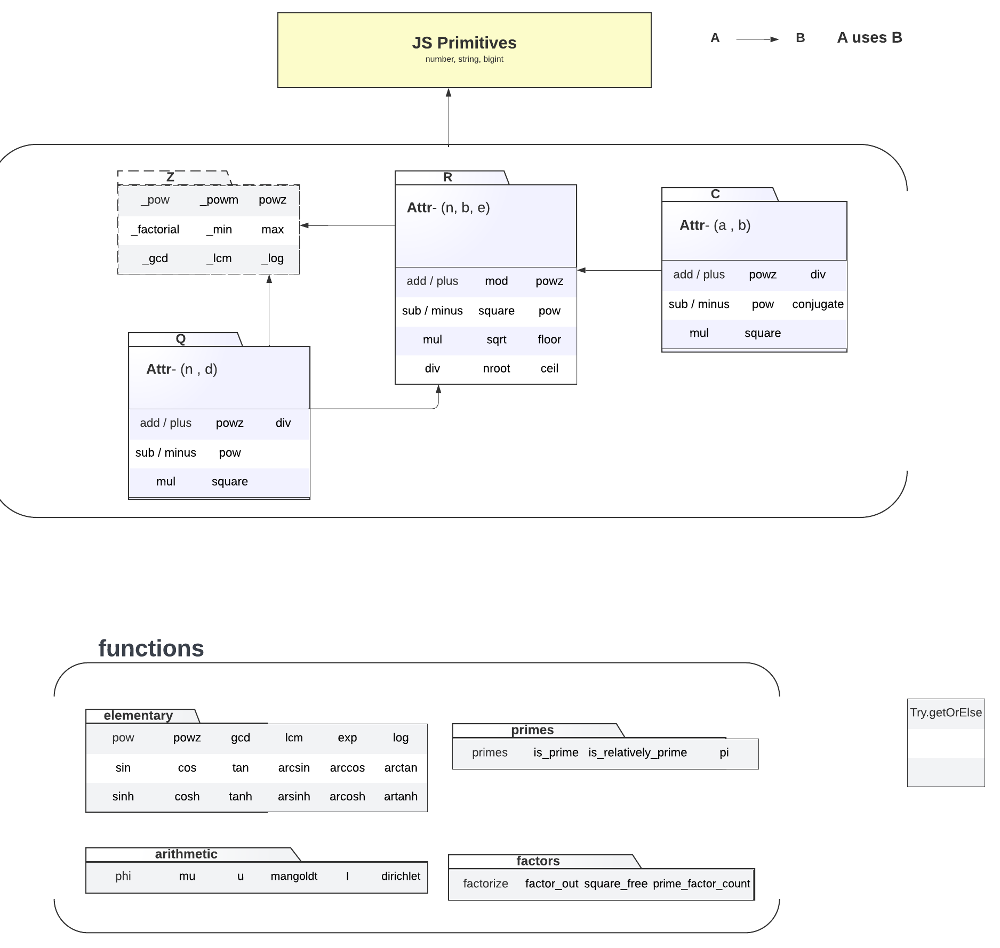

<!-- <style>
  .title {
    font-size: 72px;
    font-weight: 900;
  }

  .title-name {
    background: -webkit-linear-gradient(45deg, #00ff36, #003aff);
    -webkit-background-clip: text;
    -webkit-text-fill-color: transparent;
  }

  .title-initial {
    color: #07ba44 !important;
  }

  .title-ext {
    color: #ff5050 !important;
  }
</style>

<h1 class = "title">
  <span class="title-initial">r</span><span class="title-name">math</span><span class="title-ext">js</span>
  v2
</h1> -->


An advanced, high-precision mathematics library for JavaScript and TypeScript. `@rmath/rmathjs` provides comprehensive support for arbitrary-precision decimals, real numbers, fractions, and complex numbers, along with an extensive collection of arithmetic operations and transcendental functions.

## Architecture


## Installation


```bash
npm install @rmath/rmathjs

```

---

## Configuration

To customize or initialize library configurations (such as global precision settings), import the configuration object:

```javascript
import { config } from "@rmath/rmathjs";

// Config Options
export type ConfigType = {
  precision : number,
  base : number
  string : "string" | "object"
}
```

---

## Initialization & Data Types

The library natively supports four core numerical types: `decimal`, `real`, `fraction`, and `complex`. These can be instantiated using numbers, strings, or BigInts.

### Decimals & Real Numbers

```javascript
import { decimal, real } from "@rmath/rmathjs";

// Initialize from a string
var n = decimal("121");
console.log(n.toString()); 
// Output: 121

// Initialize as a real number
var n = real("121");
console.log(n.toString()); 
// Output: 121

// Initialize from a standard floating-point number
var n = decimal(12134.121);
console.log(n.toString()); 
// Output: 12134.121

// Initialize an arbitrary-precision large decimal string
var n = decimal("1213212012910920131209381023809128091300128309192931.1212839182312931820391");
console.log(n.toString()); 
// Output: 1213212012910920131209381023809128091300128309192931.1212839182312931820391

// Initialize from a BigInt
var n = decimal(12134n);
console.log(n.toString()); 
// Output: 12134

// Initialize from scientific notation
var n = decimal(1.2134121e4);
console.log(n.toString()); 
// Output: 12134.121

```

### Fractions

Accepts either a single string of the form `"r/q"`, or two separate parameters `fraction(a, b)` where parameters are integers, BigInts, strings, or rational objects. `b` must not be null or undefined.

```javascript
import { fraction } from "@rmath/rmathjs";

// Initialize from a single fraction string
var f = fraction("1213/1231231");
console.log(f.toString()); 
// Output: 1213/1231231

// Initialize from numerator and denominator integers
var f = fraction(1213, 1231231);
console.log(f.toString()); 
// Output: 1213/1231231

// Initialize from fraction string arguments (simplifies automatically)
var f = fraction("3/12", "3/4");
console.log(f.toString()); 
// Output: 1/4

```

### Complex Numbers

Accepts a single string formatted as `"a+ib"`, or separate real and imaginary components.

```javascript
import { complex } from "@rmath/rmathjs";

// Initialize from a single complex number string
var c = complex("1+2i");
console.log(c.toString()); 
// Output: 1+2i

// Initialize from distinct real and imaginary components
var c = complex("1", 2);
console.log(c.toString()); 
// Output: 1+2i

```

---

## Basic Operations

The primary numerical objects expose instance methods to perform high-precision arithmetic operations.

```javascript
import { real } from "@rmath/rmathjs";

let a = real("12121210901921.912091201");
let b = 1212918212918291892189281n;

// Addition
var r = a.add(b);
console.log(r.toString()); 
// Output: 1212918212930413103091202.912091201

// Subtraction
var r = a.sub(b);
console.log(r.toString()); 
// Output: -1212918212906170681287359.087908799

// Multiplication
var r = a.mul(b);
console.log(r.toString()); 
// Output: 14702037465564842672031911863800000000

// Division
var r = a.div(b);
console.log(r.toString()); 
// Output: 0.000000000009993428058729674783457430491

// Additive Inverse (-a)
var r = a.addinv();
console.log(r.toString()); 
// Output: -12121210901921.912091201

// Multiplicative Inverse (1/a)
var r = a.mulinv();
console.log(r.toString()); 
// Output: 0.00000000000008250000829879482

// Modulo / Remainder
var r = real(b).mod(a);
console.log(r.toString()); 
// Output: 6284415173512.910290169

// Integer Verification (Checks if number is an integer)
var r = a.isInteger();
console.log(r.toString()); 
// Output: false

var r = real(1212891381938198319839183).isInteger();
console.log(r.toString()); 
// Output: true

```

---

## Mathematical Functions

All core functions are precision-optimized and support huge numbers, decimals, fractions, or complex numbers.

### `gcd`

Computes the greatest common divisor of two large integers.

```javascript
import { gcd } from "@rmath/rmathjs";
var r = gcd(12121323232, 1212903239029012309182903810283190312n);
console.log(r.toString()); 
// Output: 8

```

### `factorial`

Calculates the factorial of a given integer.

```javascript
import { factorial } from "@rmath/rmathjs";
var r = factorial(112);
console.log(r.toString()); 
// Output: 197450685722107402353682037275992488341277868034975337796656295094902858969771811440894224355027779366597957338237853638272334919686385621811850780464277094400000000000000000000000000

```

### `pow`

Performs modular exponentiation efficiently on integers.

```javascript
import { pow } from "@rmath/rmathjs";
var r = pow(233, 13232, 1000000);
console.log(r.toString()); 
// Output: 799361

```

### `powz`

Computes number raised to integer power.

```javascript
import { powz } from "@rmath/rmathjs";
var r = powz(121, 10);
console.log(r.toString()); 
// Output: 672749994932560009201

var r = powz("1 + 2i", 2);
console.log(r.toString()); 
// Output: -3+4i

```

### `exp`

Calculates the exponential function of a value.

```javascript
import { exp } from "@rmath/rmathjs";
var r = exp(10);
console.log(r.toString()); 
// Output: 22026.4657948067165169579006449

var r = exp(1.71);
console.log(r.toString()); 
// Output: 5.52896147762400405587885235146

```

### `log`

Computes logarithm of number to specified base.

```javascript
import { log } from "@rmath/rmathjs";
var r = log(1000, 10);
console.log(r.toString()); 
// Output: 2.99999999999999999999999970088

var r = log(1500, 12);
console.log(r.toString()); 
// Output: 2.94305638713399091876584804139

```

### `ln`

Returns natural logarithm of a given value.

```javascript
import { ln } from "@rmath/rmathjs";
var r = ln(1000);
console.log(r.toString()); 
// Output: 6.907755278982137052053973675304

```

### `sin`

Computes the sine of an angle in radians.

```javascript
import { sin } from "@rmath/rmathjs";
var r = sin(1.50);
console.log(r.toString()); 
// Output: 0.997494986604054430941723371142

```

### `cos`

Computes the cosine of an angle in radians.

```javascript
import { cos } from "@rmath/rmathjs";
var r = cos(1.50);
console.log(r.toString()); 
// Output: 0.070737201667702910088189851434

```

### `tan`

Computes the tangent of an angle in radians.

```javascript
import { tan } from "@rmath/rmathjs";
var r = tan(1.50);
console.log(r.toString()); 
// Output: 14.101419947171719387646083652

```

### `arcsin`

Computes arcsine value; requires domain constraint input properties.

```javascript
import { arcsin } from "@rmath/rmathjs";
var r = arcsin(.10);
console.log(r.toString()); 
// Output: 0.100167421199311755952380952381

```

> *Note: Only accepts real input domain within `[-1, 1]` to output real numbers.*

### `arccos`

Computes arccosine value; requires domain constraint input properties.

```javascript
import { arccos } from "@rmath/rmathjs";
var r = arccos(.10);
console.log(r.toString()); 
// Output: 1.4706289055955848632789407392

```

> *Note: Only accepts real input domain within `[-1, 1]` to output real numbers.*

### `arctan`

Computes the arctangent of a given number.

```javascript
import { arctan } from "@rmath/rmathjs";
var r = arctan(.10);
console.log(r.toString()); 
// Output: 0.099668652491162027378446119878

```

### `sinh`

Computes hyperbolic sine of a given number.

```javascript
import { sinh } from "@rmath/rmathjs";
var r = sinh(1.50);
console.log(r.toString()); 
// Output: 2.12927945509481749683438749467

```

### `cosh`

Computes hyperbolic cosine of a given number.

```javascript
import { cosh } from "@rmath/rmathjs";
var r = cosh(1.50);
console.log(r.toString()); 
// Output: 2.35240961524324732576766796544

```

### `tanh`

Computes hyperbolic tangent of a given number.

```javascript
import { tanh } from "@rmath/rmathjs";
var r = tanh(1.50);
console.log(r.toString()); 
// Output: 0.905148253644866438242303696456

```

### `arcsinh`

Computes inverse hyperbolic sine of a number.

```javascript
import { arcsinh } from "@rmath/rmathjs";
var r = arcsinh(1.50);
console.log(r.toString()); 
// Output: 1.194763217287109304111930829597

```

### `arccosh`

Computes inverse hyperbolic cosine; requires domain constraint input properties.

```javascript
import { arccosh } from "@rmath/rmathjs";
var r = arccosh(1.50);
console.log(r.toString()); 
// Output: 0.96242365011920689499551782761

```

> *Note: Only accepts real input domain `x >= 1` to output real numbers.*

### `arctanh`

Computes inverse hyperbolic tangent; requires domain constraint input properties.

```javascript
import { arctanh } from "@rmath/rmathjs";
var r = arctanh(0.10);
console.log(r.toString()); 
// Output: 0.100335347731075580635726552489

```

> *Note: Only accepts real input domain within `(-1, 1)` to output real numbers.*


# Convections
## Naming Convections
1. Class / Interface / types should be in CapitalCammelCase.
2. Variable name should be in flatcase / snake_case
3. Constants should be in UPPER_CASE.

# Motivation
Motivation is to create libary able to do any mathematical task in js efficiently.

# Mentions
Below software / tools helped **rmathjs** to get is struture.
1. Regex helper -> https://regex101.com/r
2. decimal.js -> https://github.com/MikeMcl/decimal.js/